# :mirror: Relic - Game Design Document (GDD)

## :bookmark_tabs: Table of Contents
* [Game Overview](#game-overview)
* [Story and Narrative](#story-and-narrative)
* [Gameplay and Mechanics](#gameplay-and-mechanics)
* [Levels and World Design](#levels-and-world-design)
* [Art and Audio](#art-and-audio)
* [User Interface (UI)](#user-interface--ui-)
* [Technology and Tools](#technology-and-tools)
* [Team Communication, Timelines, and Task Assignment](#team-communication-timelines-and-task-assignment)
* [Possible Challenges](#possible-challenges)

## ​Game Overview​
*Relic* is a third person, angled top-down puzzle game based around perception, light and memory. The player must navigate through a series of 7 (+?) levels, interacting with objects such as switches, buttons and levers. 
The main mechanic of the game is a system in which objects that are no longer observed by a light source leave an imprint of their last seen location. However the real object can still move around without being observed by the player. 

## Story and Narrative
*Relic* has the player controlling a ghost who has decided to delve into the dark and mysterious ruins of a manor where relics of great power are said to reside. Guarded by malevolent spirits, the relics in this manor are said to hold great power and can accomplish many things. There is legend that one can even raise the dead...

Determined to plough through any obstacle necessary, the game follows the main character trekking through the various perils and obstacles of the manor to get his hands on a relic that can revive his body and bring his wandering soul back to the material plane. Stormvich Manor has notoriously swallowed many brave souls that dare to attempt to wield the dark power of the great Theobold Stormvich, who imbued many objects with wonderous properties before passing centuries ago. However, he did not leave his legacy unguarded, hiding his precious relics hidden within a series of intricate puzzles that are designed to confuse and befuddle would-be adventurers and slowly wear away at their sanity. Objects appear to move on their own under the cover of darkness. Ghostly images of where objects once were open passages that lead deeper and deeper into different parts of what is remaining of the Stormvich Manor. And did that angel just move...?

Various curses wait to be seen on the journey to raise the dead. Let's just hope that this is all Theobold Stormvich had in mind...

## Gameplay and Mechanics
### Room-Based Progression
The game is split into a number of levels, called 'rooms'. Each room has a puzzle that the player needs to proceed to the next room. Every room introduces a new mechanic
or builds upon a previous mechanic. To progress to each room, the player must solve the room's puzzle, 
which will open a door. The player can then proceed through the door, unlocking the next room.

### Player Controls
The player is a 2.5D character that can move freely in the X-Z plane. The player uses third-person controls with 
directional keys controlling their movement. The player has one set speed and moves in 8 directions (if using a keyboard).

  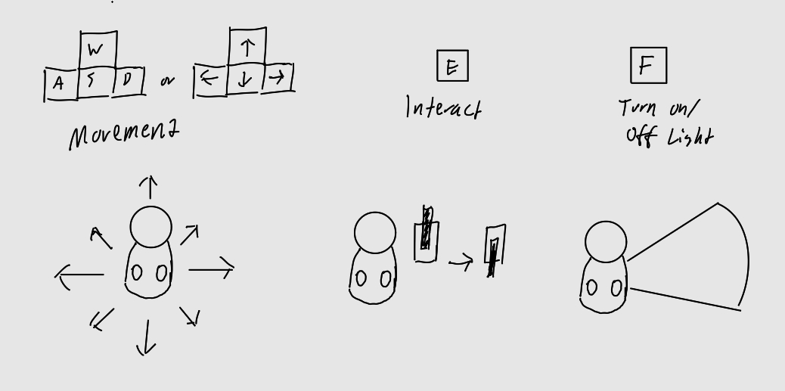

### Switches and Doors 
Each room holds a number of switches. All switches must be activated in order for the door to be open. The door
has a shutter that takes a period of time to open completely. If any switch deactivates during the shutter opening,
it will close automatically. The shutter must be fully open in order for the player to proceed through the door.

  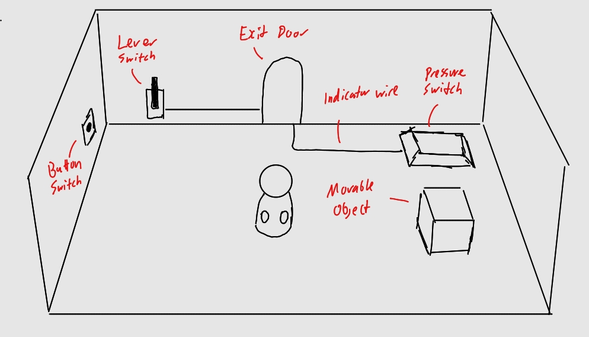

There are different types of switches:
* Pressure-type switches are on the ground and will only activate if there is something pressing down on it. This can be the player, or an object with sufficient mass.
* Lever-type switches are on the walls or other objects and will only activate if the player interacts with the button. Once pressed, the switch will remain on unless turned off manually by the player.
* Button-type switches are similar to levers in that the player must interact with them to turn them on. However, they are only on for a set amount of time. After the timer ends, the button is turned off automatically and must be turned on  manually again.

### Movable Objects
Certain objects can be moved by the player. They are moved if the player walks into them and are slowly pushed along the surface.
Objects have mass and can be used to block movement if stuck or press down on switches.

Different types of blocks:
* Basic Blocks can be pushed by the player by moving into them. 

* Cursed Blocks move in a set pattern by themselves. If the player moves in the way of the block, the player will be pushed. 

* Ethereal Blocks can be in one of multiple positions. When one of it's positions is observed in the light, it instantly appears in one of those positions (even the one not in the light). If a player is standing directly in one of it's positions, it cannot appear in that position.

  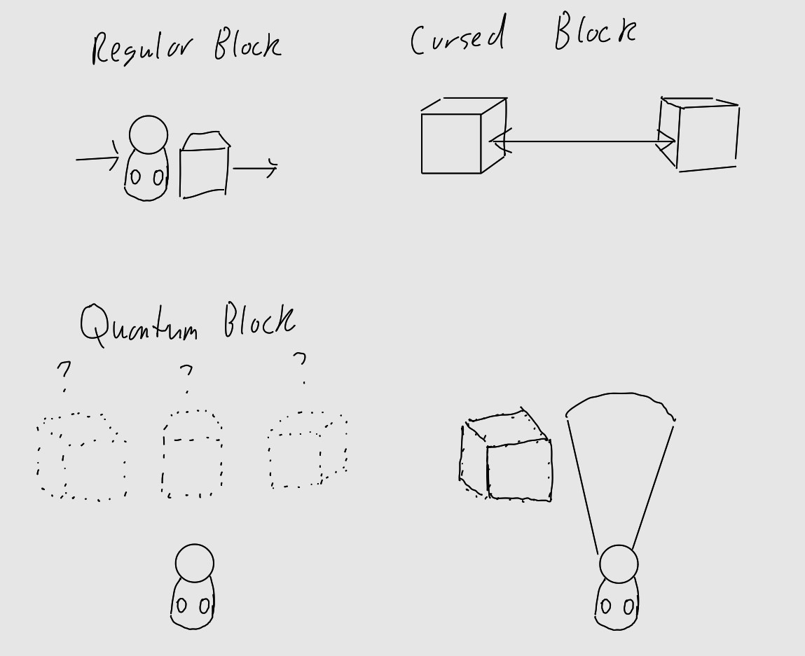

### The Dark
All objects exist in the darkness, a base world where there is no light. Any objects present in The Dark cannot be seen by the player, meaning they are the same colour as their surrounding
environment and have no depth to perceive. The player can still interact with objects in The Dark, and objects can move freely without the player being aware.

### The Light
The player has control over The Light, a powerful tool that brings The Dark into vision. The Light acts as a cone of vision in front of the player. Any objects 
in The Light will be illuminated, allowing the player to see and interact with the world originally shrouded in The Dark. The Light is emitted in the direction 
the player is facing, meaning that it will move if the player moves as well.

  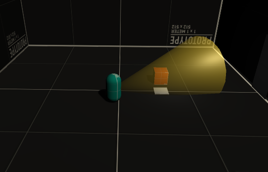

### Shadows
Objects that leave The Light after being illuminated will leave an imprint of itself on the level. This is the player's 'memory' of the object
and will represent the object's last known position. Shadows retain their mass and interactivity, meaning it can interact with switches and the player.
However, the Shadow of the object disappears if the original object is revealed by The Light or if the shadow comes in contact with The Light again.

  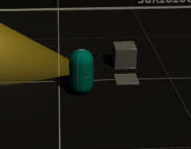

### Statues
Statues are "hostile" enemies which seek to harm the player. Statues are inactive until they are revealed by The Light. Once active, they begin moving slowly towards the player in the Dark. If exposed to The Light, they stop moving. Upon contact with a statue, the player's vision fades to black and the level is restarted.

  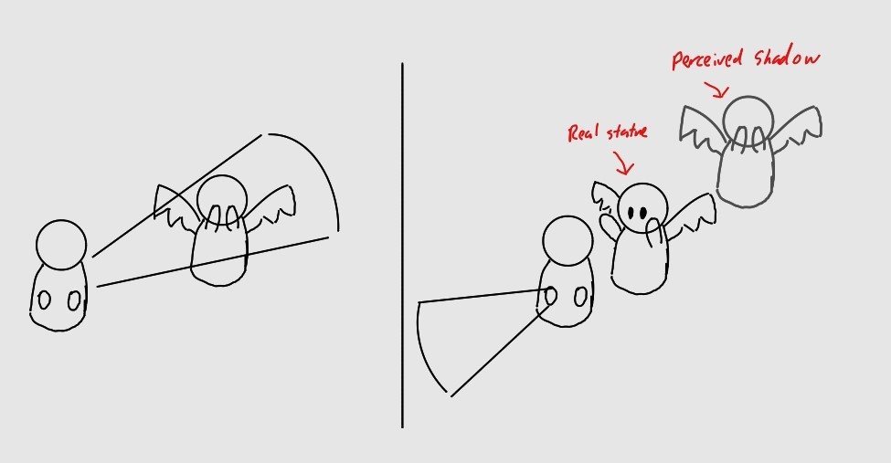

Using statues to activate switches

  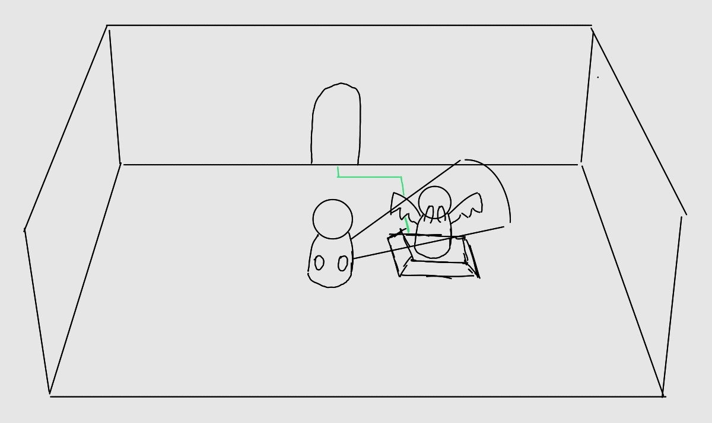

## Levels and World Design
### Game World
The game is set in a 2.5D world, with an angled view (not top-down). This camera angle is similar to Link's Awakening or Luigi's Mansion 3, allowing 
the player to see the 3D details of the world's assets. The world is set in an abandoned gothic mansion with a labyrinth of rooms. Each room is connected 
to the next, with the final room filled with scriptures explaining the lore of the mansion.

**NOTE: The following contains solutions to all the puzzles which will be in game. As such, a spoiler warning is in effect.**

  
 Level 1 Design 

### Level 1 - Moving Around
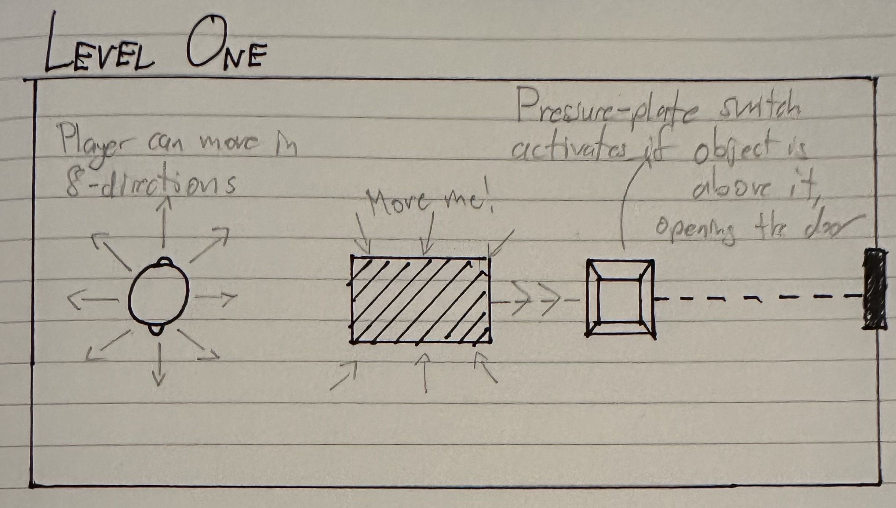

The first level introduces the player to switches and movable objects. The only objects in the scene are a shelf, a switch, and the door.
There is no Light or Dark in this level, everything is illuminated. The player must move the shelf onto the switch in order to progress through the door.
There will be a prompt above the shelf, indicating the player that it can be moved.

  
 Level 2 Design 

### Level 2 - Let There Be Light
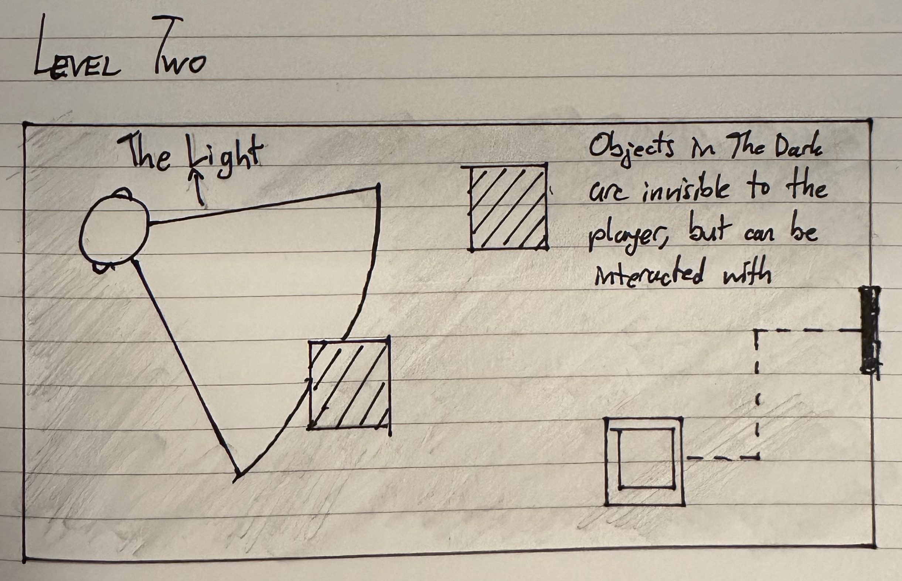
The second level introduces the player to the concept of Light and Dark. Each level from now on is shrouded in The Dark, but they will be visible
for a brief moment at the start of the level before becoming covered in The Dark. This is to make the player familiar with the layout of the level.
When the level is thrown into darkness, there will be a prompt to tell the player to activate The Light to see their surroundings.
Level 2 is similar to Level 1, except that the shelf is in a more hidden spot, making it harder for the player to find the shelf without using The Light.

  
 Level 3 Design 

### Level 3 - Using Shadows
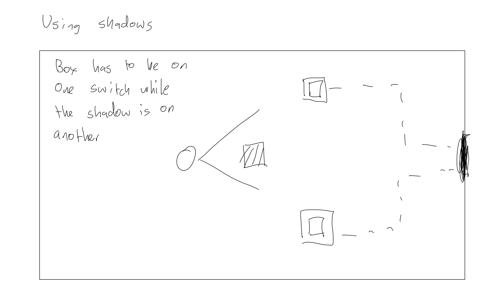
The third level introduces the player to the concept of shadows. They will have to move the block over one switch, turn off their light, and then move the block back to the other switch in the dark to activate both switches at once and open the door.

  
 Level 4 Design 

### Level 4 - The Door Stays Open
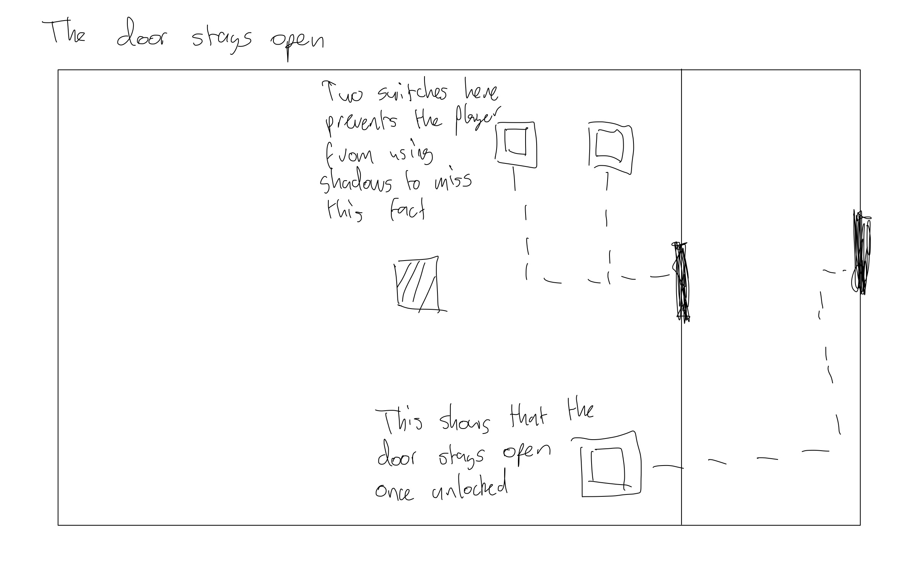
This level demonstrates to the player how the door stays open once unlocked. There is one switch that can unlock the exit, but two switches to open a door to the room that has the exit. However, there is only one block. The player will have to first unlock the door, and then use the same shadow trick from before to open the second door, allowing them to exit.

  
 Level 5 Design 

### Level 5 - Stopped in Their Tracks
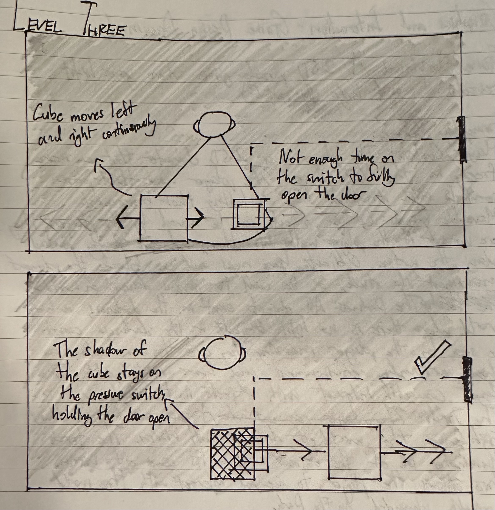
The fifth level introduces the player to cursed blocks. There is a cursed block that passes over a switch.
The cursed block moves over the switch fast enough that the door does not open in its entirety. If the player observes the cube with The Light, they will see that the 
cursed block will leave shadows at the edges of The Light's cone of vision. To proceed, the player must turn off The Light at the moment the cube is over the switch. This will leave a 
shadow of the cube above the switch, which will activate it and allow the player to proceed through the door.

  
 Level 6 Design 

### Level 6 - 2 Switches, 1 Block
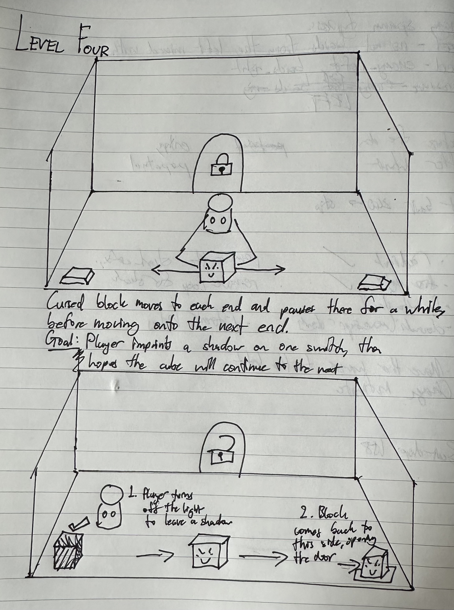
The sixth level slightly increases the difficulty of the cursed block. To the player, there are two
switches, but only one block. The block moves to either end of the room, pausing on each switch. To 
progress through, the player must leave a shadow on one of the switches. The player must then not look at
the block again, otherwise the shadow disappears. Once the cursed block moves to the other switch (while 
the shadow is on the first switch), the door will open briefly, allowing the player to go through.

The intended learning outcome of this level is to make sure that the player understands that **objects still
move in the Dark**, as they are contingent on the cursed block moving while its shadow remains on the switch.

  
 Level 7 Design 

### Level 7 - Trapped Block
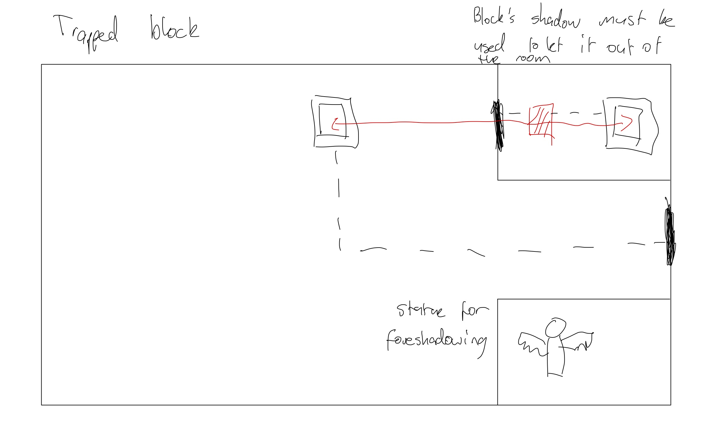
This level builds on the previous level, requiring the player to strategically create a shadow to free the cursed block from a room, allowing it to depress the switch that unlocks the door.

  
 Level 8 Design 

### Level 8 - Controlling the Curse
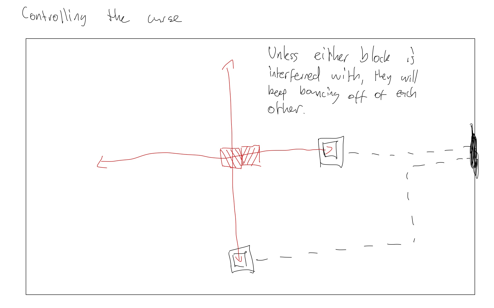
This level demonstrates that the player can still interact with cursed blocks. If the player does not intervene, the cursed blocks will bounce off each other indefinitely and not unlock the exit. To pass, the player must impede the progress of one of the blocks, throwing off the timing that is making the blocks bounce off each other.

  
 Level 9 Design 

### Level 9 - Blocks in Tandem
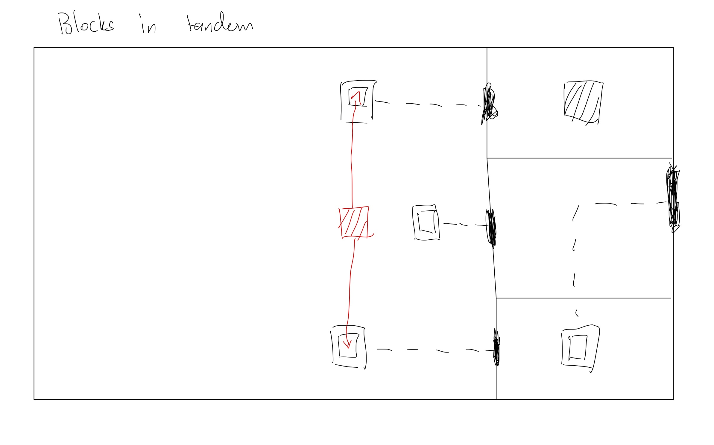
This level requires the use of both cursed blocks and regular blocks. A cursed block must be used to unlock a regular block. The same cursed block then unlocks the room to which the switch to open the exit is located. Finally, the player then uses the block to open the exit.

  
 Level 10 Design 

### Level 10 - Ethereal Block Introduction

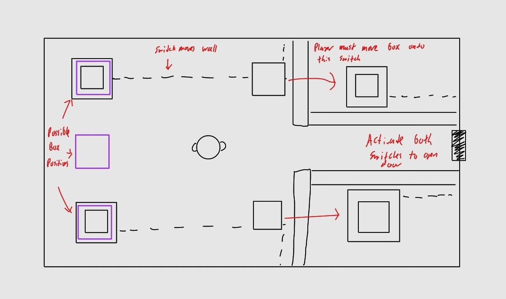
Level 5 is the introduction of the ethereal block. There are 3 possible places the block can spawn on the left side of the screen. Two of them have pressure plates which open doors the player can push blocks through. The player must push two boxes through the doorways by manipulating where the ethereal blocks spawn. Once the two switches on the right side of the room are activated, the door opens.

  
 Level 11 Design 

### Level 11 - Ethereal Shenanigans
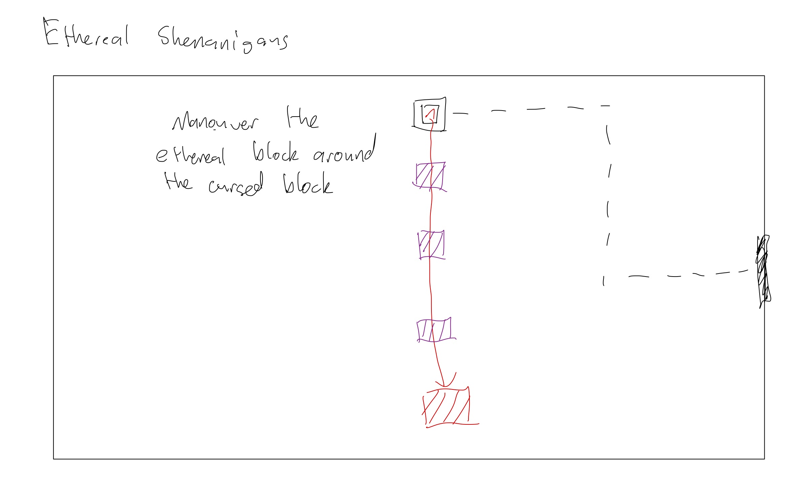
This level combines ethereal blocks and cursed blocks. An ethereal block must be manipulated around a cursed block so that the cursed block is able to make its way across the room to the switch that unlocks the exit.

  
 Level 12 Design 

### Level 12 - Remote Controlled Block
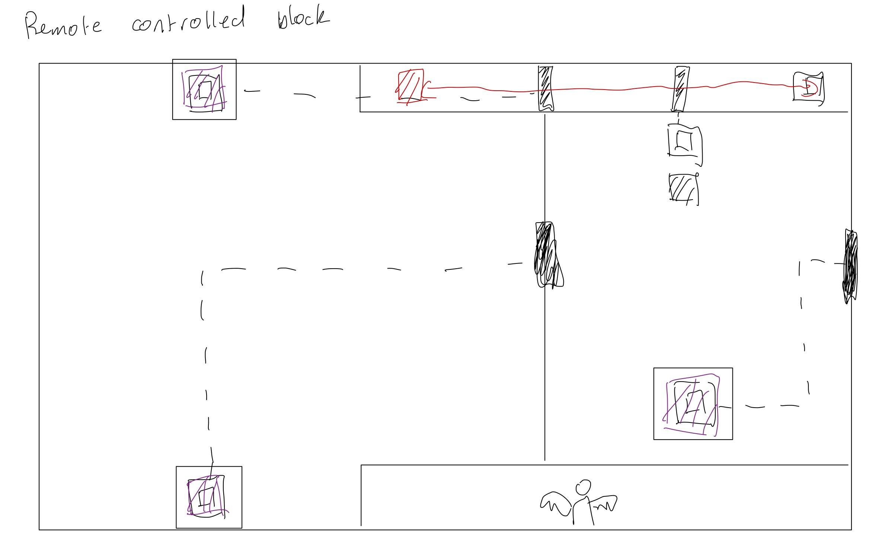
This level requires some thinking from the player to manipulate doors impeding the progress of a cursed block by manipulating an ethereal block and a regular block.

  
 Level 13 Design 

### Level 13 - Bait and Switch

The thirteenth level introduces the concept of statues to the player. Originally, the statue is blocking 
the path of the cursed block. To progress, the player must realise that the statue is sentient and can 
move towards them. In doing so, the player can position the statue and free the path of the cursed block.
Then, the player must micromanage the statue and the shadow of the cursed block so that they can 
make it to the door safely.

The intended outcome of this level is to make sure that the player understands that **statues are sentient
and hostile**. The player is forced to manipulate the statue to progress the level, and has the chance of 
losing when the statue gets too close.

  
 Level 14 Design 

### Level 14 - Beware the Prisoners
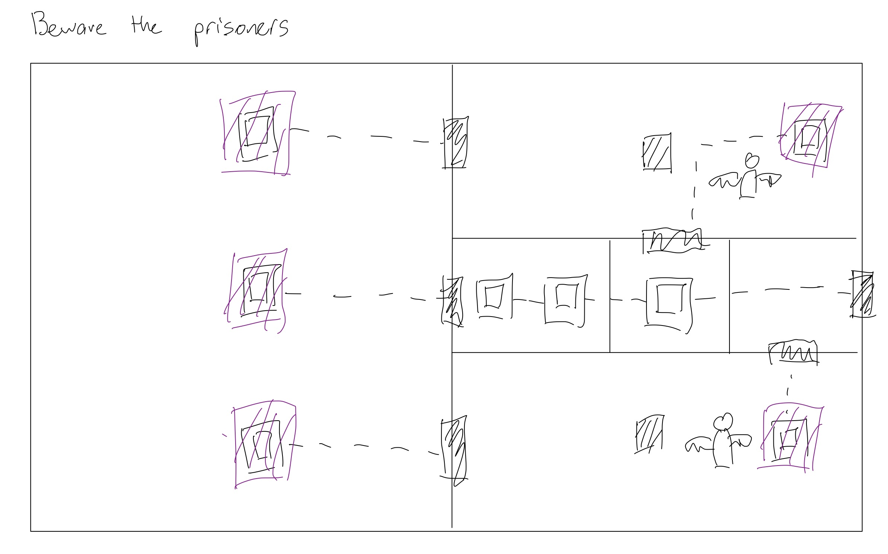
This level is a maze of rooms that requires the manipulation of an ethereal block to only unlock one door at a time. However, there are two statues lurking in these rooms that pose a danger to the player as they try to move blocks from room to room to finally open the exit. This level should be tense as it is hard to progress while keeping your light on the statues, so much caution should be taken.

  
 Level 15 Design 

### Level 15 - Leap of Faith
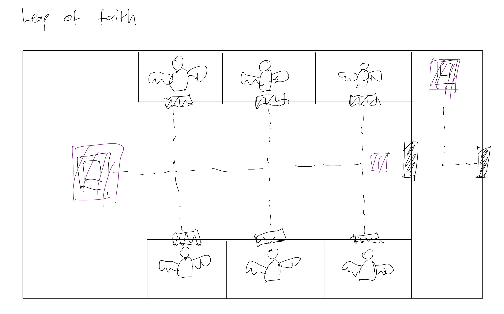
The final level is an amazing climax of tension. An ethereal block can be placed over a switch that unlocks the door to the exit room, however doing so releases six statues. The player must move towards the exit with their flashlight off, however, as leaving it on will close the door they need to get through by moving the ethereal block. This means they must make a leap of faith and charge forward, hoping the let loose statues don't catch up to them.

### Level 16 - Leap of Faith
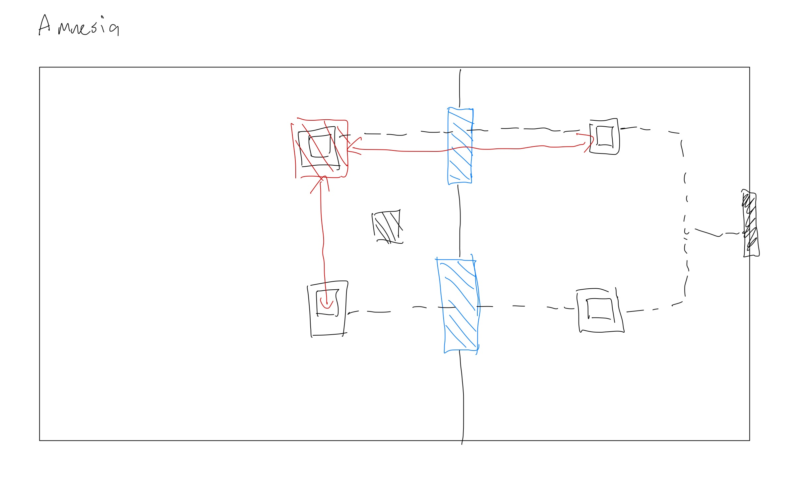
This level serves as the introduction for ghost walls. There are four buttons that need to be pressed to open the door with only two blocks. The solution is to push the block to the other side of the ghost wall, use it and its shadow to press those two switches, and then use the cursed block and its shadow to press the other two switches. Through this solution, it teaches the player how ghost walls work, that you can push blocks through them, and interact with your flashlight beyond them.

### Level 17 - Leap of Faith
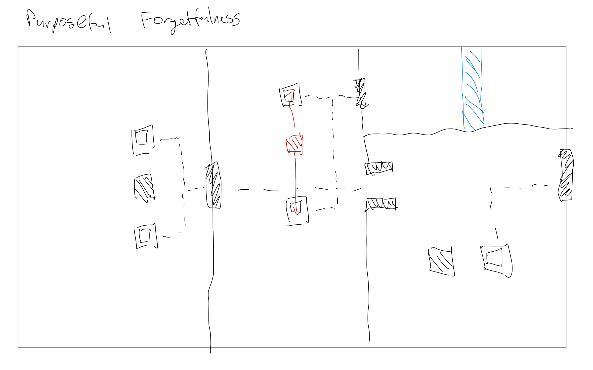
This level gets more creative with the ghost walls, requiring the player to "forget" some of their previous shadows to reach the final door.

## Art and Audio

### Inspiration :thought_balloon:

We would like to give a special mention to *Luigi's Mansion* in this section for giving us the inspiration and an example of how to effectively create the right balance of **tension and relief** - the cycle of player going from uncovering the ghosts to being able to eliminate them - without pushing too far by having the **not so scary (at all) creeps**, **frequent breaks** for player to just explore the area for loot and **quirky sound effects** throughout the game. 

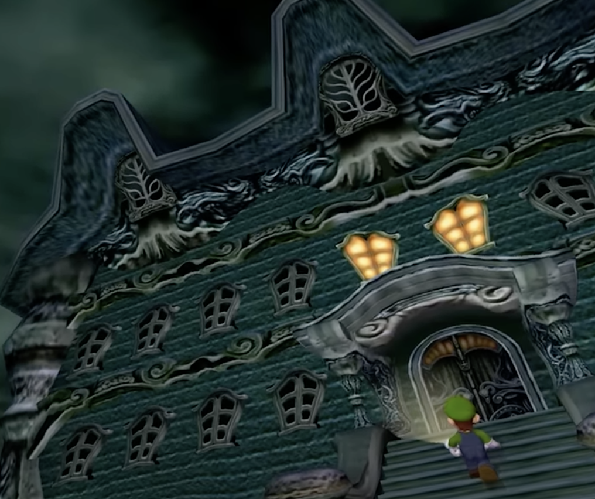

> Luigi's Mansion Gameplay: Intro (https://youtu.be/6w3qTjjxctI?si=e3qjavJwft5Akqbn)
>
> We will also be incorporating an adventure and environment exploration setup where the player navigates the world with a torch.

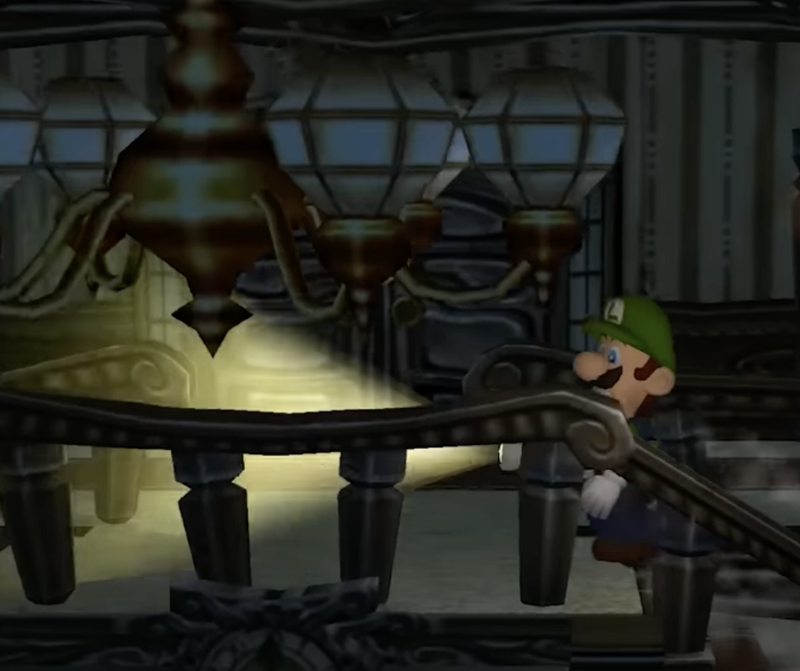

> Luigi's Mansion Gameplay: Interior
>
> Our game will adopt a similar taste when it comes to scene decorations, carefully crafting an atmosphere that resonates with the dark, mysterious, and eerie themes we've drawn inspiration from.

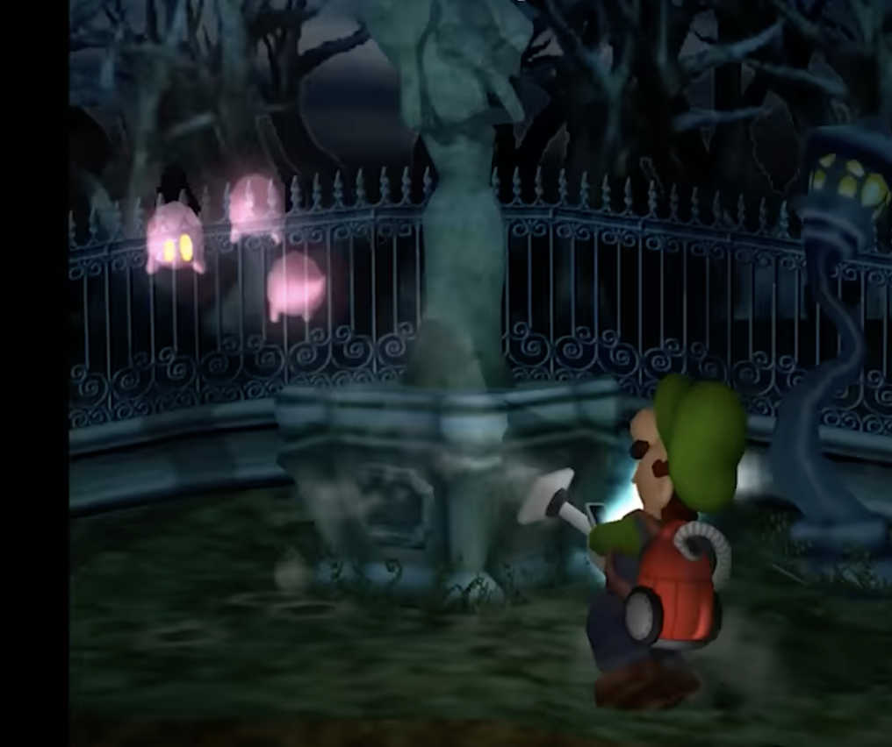

> Luigi's Mansion Gameplay: Vacuuming away creeps
>
> Interesting mechanics, but we will be doing something that is entirely different.

We cannot wait to showcase how we translate the atmosphere uniquely, and to start us off - apologies in advance that we unfortunately do not offer vacuum cleaning services in any capacity :smirk: 

### Art Style :art:

We aim to incorporate a **gothic**, possibly **medieval**, art style for our game. Imagine an abandoned mansion, with its former glory that is no longer recognisable and its once grand halls now turned into **ruins and a ground of burial**, with strange, broken objects (our block mechanics, sculptures and more to come) scattered throughout. 

The atmosphere is intended to be unsettling (eerie vibes :flushed:), with every shadow potentially hiding a secret evolving in **the Dark**, and only visible when **the Light** is shined upon as mentioned above, stressing on the enhancement of that sense of developing **tension** through constant discovery. 

Below are some examples of the sort of assets we may adopt...

> The Big Castle Kit by Triplebrick (https://assetstore.unity.com/packages/3d/environments/historic/the-big-castle-kit-75818) ^

> Dark Fantasy Kit by Runemark Studio (https://assetstore.unity.com/packages/3d/environments/fantasy/dark-fantasy-kit-123894) ^^

With our tight timeframe in mind, we realised that aiming for a highly detailed environment (see the first example ^) would potentially be overkill could jeopardise the overall quality of the project. After evaluating options available, we believe that a low-poly environment would be more suitable. This style allows us to still effectively convey the game's intended atmosphere to an extent while being more manageable within our constraints, and that more time could be spent on making the game more **interactive**.

As a result, we have eventually settled with this graveyard asset pack, that allows us to be more different, rather than just recreating something that feels too similar to Luigi's Mansion. At the same time, this will allow more flexibility and control over level designs, allowing us to craft a more distinct and engaging experience for the players.

Even though it slightly deviates from what we had imagined for the room-style progression mentioned earlier, we believe this environment suits better into the theme and potentially provides a higher degree of freedom for us to experiment with more creative lighting and different camera angles which present more learning opportunities for the purpose of this subject. This will be further discussed in [Possible Challenges](#possible-challenges).

#### Character :bust_in_silhouette:

To complement our low-poly aesthetics, we are going with a character that is simple but effective in conveying the personality of a lone adventurer. This character should embody the characteristics of determination and resilience, so that they can be perfectly suited for the task of unveiling hidden secrets and collecting the *Relic* deep inside mysterious and unknown environments of in different parts of the ruins of the mansion. 

Below is a character asset that potentially fulfills our vision,

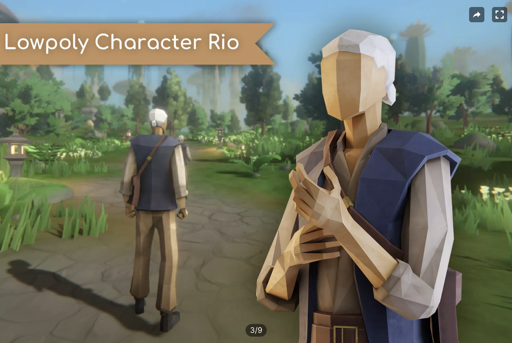

> LowPoly Survival Character Rio by VertexModeler (https://assetstore.unity.com/packages/3d/characters/humanoids/lowpoly-survival-character-rio-273074)

We are currently using a placeholder for character in Milestone 3, since we have decided to prioritise the development and realisation of game mechanics while still actively search for a character design that might better align with our theme. This decision was largely influenced by the absence of a dedicated designer on our team. However, it allows us to continue progressing with main logic implementation without diverting too much time and effort that could slow down our overall progress. At the same time, this approach keeps us flexible to potential improvements in the final character design as we move forward, with Rio being our back-up.

### Sound and Music

#### Sound Effects (SFX) :sound:

To enhance the immersive experience, we plan to implement a dynamic sound system that follows a 3D spatial audio approach. This system will allow players to hear sound effects as if they are truly within the environment, with audio sources placed in the game world that shift in intensity and direction based on the player’s location and movement. 

With the consistent **tension** our game is projecting, we believe that sound effects that we include should be offered as temporary stress **reliefs** to the player. 

For intance, a brief chime or soft ambient sound could play when the right progress of solving the level is made, or a light, melodic tone to accompany the discovery of a block hidden in the dark. These subtle audio cues can provide a calming contrast to the otherwise tense environment, allowing the player a brief respite before diving back in again, again and again...

#### Background Music (BGM) :musical_note:

The necessity of background music will need to be evaluated throughout continuous development, as having abundant sound effects might have been sufficient enough and the inclusion of background music can potentially risk overwhelming the audio experience.

## User Interface (UI)
The decision has been made that there will be no UI elements that directly communicates information to the player. Instead, it has been opted that elements in the world of the game communicates all necessary information to the player. This is done to create a more immersive experience in which it feels like the world is reacting to the player's actions rather than it being communicated through UI elements.

To begin with, there are no aspects of the game that traditionally communicate to the player with UI elements such as health bars or score displays. The only useful information to communicate is how the player's actions have affected the world. This comes in the form of wires illuminating when certain switches are depressed, communicating exactly which door(s) are being affected. Examples of this can be seen in the provisional sketches for level 1 and 2.

The one UI element that players will interact with is the main menu screen. For this, we will present the eerie atmosphere of the first room the player will be exploring. On the screen will be a prompt to click to enter, at which point the door to the house will open and the player character will enter the room, leading to the start of the game. Pause menus will use the same approach, showing RELIC in the bottom left corner and freezing the game world, prompting the player to click to resume.

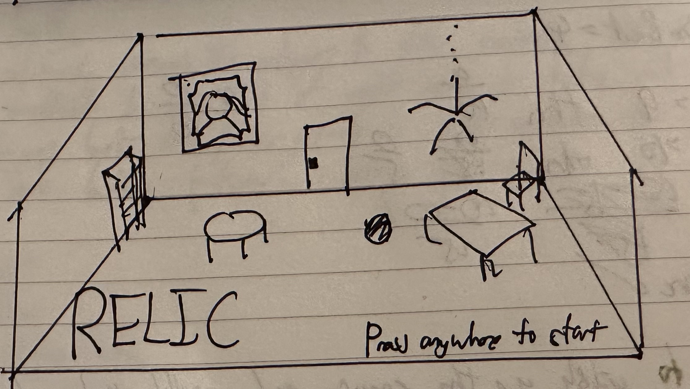
## Technology and Tools

### Github ​P​ro​j​ec​t​s​ ​& Discord :computer:

We will rely on Discord as our main communication tool and Github Projects to plan and track our progress. This is covered more in depth in [Team Communication, Timelines, and Task Assignment](#team-communication-timelines-and-task-assignment).

### Unity with WebGL Support :video_game:

**Version:** 2022.3.39f1

Unity with WebGL support is the required software for our game development process. By enabling WebGL support, Unity allows us to deploy the game directly to web browsers, so that it could be accessible across a wide range of devices. This allows our game to be <ins>easily assessed for academic purposes</ins> and most importantly, be able to <ins>gain more reach and spread more joy</ins>.

### Cinemachine :movie_camera:

**Version:** 2.9.7

In order to take the player experience to the next level, the Unity package **Cinemachine** will be utilised to <ins>allow dynamic and real-time adjustments based on different events</ins> in the game. This will be made possible by introducing **Virtual Cameras** with different properties, mainly focusing on **Body** :running: (movement) and **Aim**​ :a: (rotation).

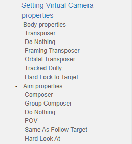

> A list of Virtual Camera properties (https://docs.unity3d.com/Packages/com.unity.cinemachine@2.3/manual/CinemachineVirtualCamera.html)

**Body Properties (B):** Govern movement relative to the target using **transposers**.

**Aim Properties (A):** Control rotation to keep the target in view using **composers**.

**Extensions (E):** 

- **Cinemachine Collider**: post-processes the final position of the Virtual Camera to attempt to preserve the line of sight with the **Look At** target of the Virtual Camera.
- **Dolly Paths:** specifies a fixed course to position or animate a Virtual Camera

Here are some potential concrete examples of how it works in different phases of the game - 

#### Introduction: 

- **(B) Orbital Transposer:** Showcasing the character potentially before the start of the game by orbiting the virtual camera around them when the game is idle. 
- **(B) Framing Transposer:** As the player approaches and enters the scene, the Framing Transposer can be used to firstly zoom in then slowly zoom out to include both the character and the looming structure of the mansion.
- **(E) Dolly Track with a Dolly Cart**: To automate an establishing shot of the introductory scene, we'll use a Dolly Track with a Dolly Cart setup. This allows the creation of a cinematic introduction that draws players into the game world right from the start. The controlled movement will help set the tone and atmosphere, providing a dynamic view of the environment that enhances the overall narrative.

#### In-Game:

- **(B) Framing Transposer:** Keeps the character centred in games like *Hades*. However, it may not be necessary since our game is not exactly a fast paced survival game.
- **(A) Group Composer:** When the character interacts with blocks as mentioned in previous sections, Group Composer will be deployed to adjust the a virtual camera's rotation to create a more balanced and visually pleasing composition of with both the character and the block in consideration.

- **(E) Cinemachine Collider:** To prevent the camera from clipping through walls or other obstacles as the player navigates tight spaces within the mansion, the Cinemachine Collider can be used. This ensures that the camera remains at an optimal distance from the character while avoiding visual glitches that could break immersion.
- **(E) Dolly Path**: To create a smoother transition through gates and potentially build suspense.

and more to be discovered as we learn more about this tool...✏️

## Team Communication, Timelines, and Task Assignment

Team communication will take place via Discord. This will cover direct messages, group communication, and
voice/video calls. Important files will also be passed through Discord (if file sizes permits), or through 
Google Drive, to ensure that everything is kept in one place as much as possible.

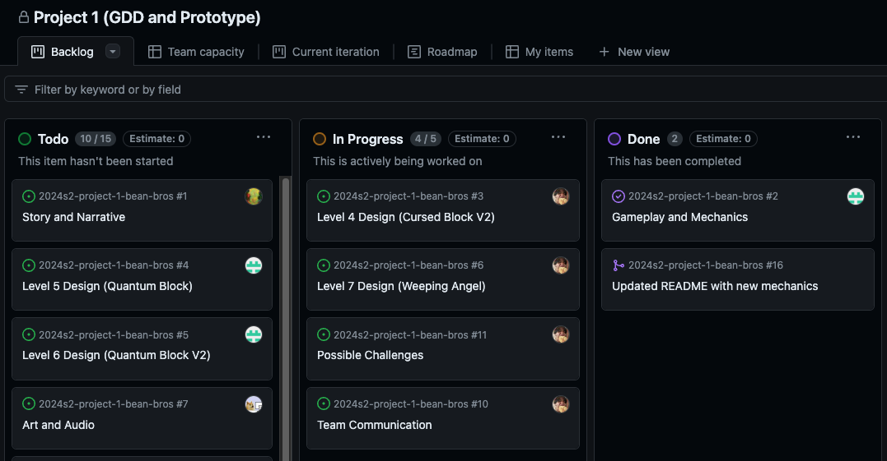
All work will be distributed, documented, and managed on GitHub itself, through Pull Request, Actions, 
and Projects. This is to ensure that all of our work is centralised in one place, without having to 
jump between arbitrary project management tools like Trello, Jira, or Monday. In this project, we will strive 
for plain text and simple task management to not overly complicate mundane processes. Every task will 
follow the same workflow:

### Creating an Issue
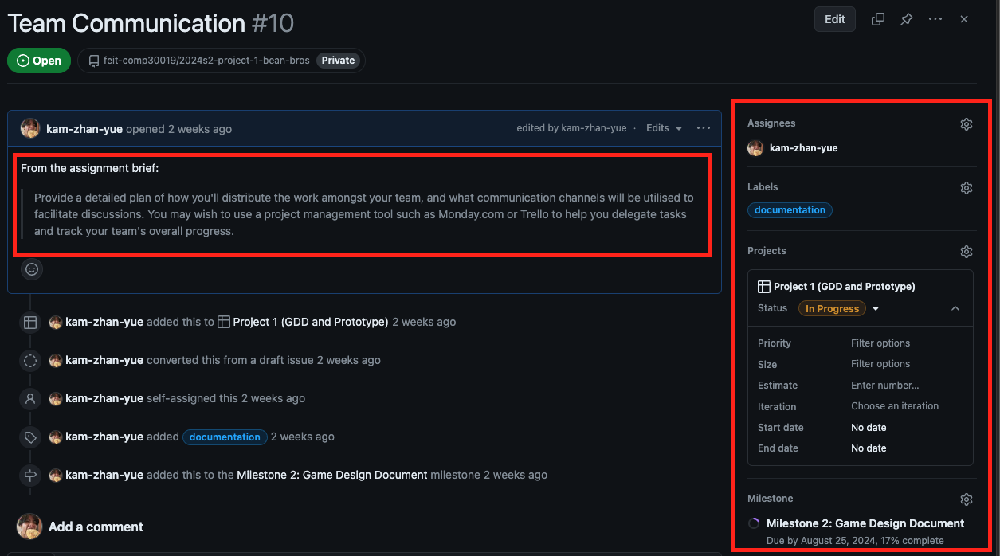
1. The task is created as an Issue with a brief description of outcomes
2. The task is assigned to a member or group (but never assigned to everyone at once)
3. Relevant labels and a milestone is attached to the issue

### Creating a Pull Request
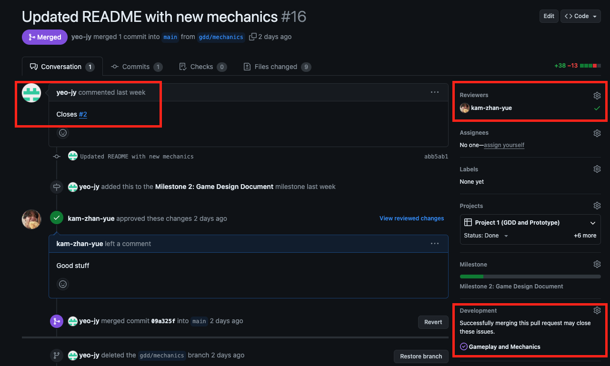
1. A branch is created for each Issue to be worked on. Issues may be grouped together in one PR if there is significant overlap.
2. A pull request is created for the branch with the relevant Issue(s) linked to it
3. Members of the team who are not assigned to the Issue are requested for review
4. Once the PR is approved, the PR is merged and the relevant Issue is closed automatically

## Possible Challenges

### Overscoping and Time Constraints
It is extremely possible to fall into the issue of overscoping the game at the beginning, resulting in 
unpolished mechanics or poorly managed time and resources. Knowing that the game needs to be completed by 
a certain date adds pressure as we need to properly allocate time for development, bug-fixing, and polishing.
A good way to not overscope is to follow the following rule

> Estimate the time you will need for the entirety of development (art, programming, music, etc). Then half it.
> Then half it again. That's the amount of time you have to finish your game.

We want to make something super polished, streamlined, and easy to complete from start to finish. We're not 
trying to make a breakthrough game, but instead using this as a learning experience. Hence, the game should 
be tight and have as small a scope as possible, to ensure that we can deliver a game we are proud of.

### Level Design
This will be the first time for many of us in creating bespoke levels around our mechanic. It will become 
apparent that many things may not fit as expected or that the mechanic itself may not be as fun as expected.
However, we believe that having a strong base of prototyping and testing will be extremely important here.
Creating a playground of mechanics and building a way to quickly iterate on ideas with minimal downtime will
become crucial in fine-tuning our level design. We hope to build this playground by Milestone 3 (The Prototype)
so that we can test and iterate throughout production.

### Shaders and Visual Communication
The game is heavily reliant on shaders to pull through with the flashlight mechanic. If we are unable to 
properly communicate this idea, it will not be intuitive for the player, resulting in limited enjoyment of the game.
To circumvent this, we need to allocate a significant portion of our time in researching, understanding, and 
testing different shader solutions for the flashlight until we are happy with the mechanic. We hope to spend 
most of our development on visually communicating the mechanic of the game to the point where it becomes
intuitive for the player to understand without a plethora of tutorials.

To address this, we hope to implement the flashlight mechanic early on (without shaders) in order to quickly 
iterate without relying on a shader solution when building the game. However, we do intend on starting 
research into shader solutions early on, hopefully implementing a simple masking shader for the prototype.
