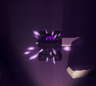

# RELIC :ghost: :jack_o_lantern:

## Table of Contents
Below is the table of contents for the Project 2 Report on RELIC. If you  would like to read the Game Design Document
(GDD), the link to it is [here](GDD.md).
- [Evaluation Plan](#evaluation-plan)
- [Evaluation Report](#evaluation-report)
- [Shaders and Special Effects](#shaders-and-special-effects)
- [Summary of Contributions](#summary-of-contributions)
- [References and External Resources](#references-and-external-resources)

## Evaluation Plan

### 🛠️ Evaluation techniques: 

Participants will be invited to explore and play through levels, specifically ones that involves our **main game mechanics** and **unique selling points (USP)**:

**Engagement & Mechanics Usability:**

- We'll evaluate how well participants understand and use the core game mechanics. We'll ask them to verbally express their thoughts during gameplay to capture moments of confusion or ease.
- **Task 1:** Players will not be given any hints and instructions and will be asked to solve in-game challenges on their own. We will monitor how ***intuitive*** these mechanics feel and note any instances where players struggle.

**Difficulty Evaluation:**

- Since our game progress with levels, we will observe how many levels participants can successfully complete before they start finding the puzzle challenging. This will help us gauge the game's difficulty curve and whether it is balanced for our target audience.

- **Task 2:** Participants will be asked to play continuously through multiple levels and provide feedback after each one. We’ll specifically track when they encounter difficulty or frustration.

  

### :family: **Participants:** 

Participants will primarily consist of people who are interested in align with the target audience for our game, ensuring that their feedback is relevant to the intended user base.

**Recruitment Process:** We will utilise the network of clubs and societies to focus on mainly interviewing design and computing students who are enthausiastic to try a new game and willing to provide feedback.

**Qualifying Criteria:**

1. **Interest in Game Genre:** Participants should express a genuine interest in our game’s genre.

2. **Experience Level:** A mix of both casual and experienced gamers to ensure well-rounded feedback.

3. **Availability:** Participants must be available to complete the playtest and provide feedback within the evaluation timeline.

### :bar_chart: **Data collection:**

| Qualitative Data                           | Collection Process                                           | Tool  Used      |
| ------------------------------------------ | ------------------------------------------------------------ | --------------- |
| ***Comments*** regarding different levels  | Participants will be tasked to provide verbal feedback during and after each level in a "thinking aloud" manner, where they share thoughts on the level design, difficulty, and mechanics as they play. Additionally, record post-play discussion for specific comments on focused on specific levels, for example which level left the most impression, i.e., most engaging and which level failed to provide an enjoyable playing experience. | Google Docs     |
| Aesthetic and atmosphere ***impressions*** | Gather participants' thoughts on the game’s aesthetic during post-play discussions or written surveys, focusing on immersion and overall appeal. | Feedback Fruits |

| Quantitative                        | Collection Process                                           | Tool Used     |
| ----------------------------------- | ------------------------------------------------------------ | ------------- |
| ***Time*** taken to complete levels | Use manual tracking (at the current stage, since a in-game timer can be pontentially implemented to keep track of best time taken to complete levels and game) to record how long participants take to complete each level. This will help measure the game's difficulty curve and pacing. | Google Sheets |
| Overall ***rating***                | Ask participants to provide a rating out of 10 of their overall experience | Google Sheets |

### :1234: **Data analysis:** 

**Qualitative Data:**

- **Thematic Analysis:** We will review participant feedback from interviews, surveys, and think-aloud sessions. The feedback will be categorised into themes such as ***enjoyment***, ***frustration***, ***confusion***, and ***suggestions for improvement***. These themes will help identify patterns in ***user experience*** that require further refinement.
- **Sentiment Analysis:** Feedback from participants will be analysed for overall sentiment to assess player satisfaction, with a focus on areas such as game mechanics, level design, and aesthetic appeal. Negative sentiments will indicate areas needing immediate attention.

#### **Quantitative Data:**

- **Completion Times:** We will calculate the average time taken by participants to complete each level. This data will help assess the pacing and difficulty curve of the game, ensuring levels aren't too long or too challenging.

### :calendar: ​**Timeline:**

#### Week 11:

| Day           | Task                                                         |
| ------------- | ------------------------------------------------------------ |
| **Monday**    | 🎯 *Milestone 1: Evaluation Demo Due*                         |
| **Tuesday**   | :busts_in_silhouette: Participant Recruitment at Game Maker's Club and Collect Data |
| **Wednesday** | :busts_in_silhouette: Participant Recruitment at Game Maker's Club and Collect Data |
| **Thursday**  | 🎬 Gameplay Video Production                                  |
| **Friday**    | 🎬 Gameplay Video Production                                  |
| **Saturday**  | 🎬 Gameplay Video Production                                  |
| **Sunday**    | 🎬 Gameplay Video Production                                  |

**📝 Evaluation Report - 0%**

#### **Week 12:**

| Day           | Task                                                    |
| ------------- | ------------------------------------------------------- |
| **Monday**    | 🎯 *Milestone 2: Gameplay Video Due*                     |
| **Tuesday**   | 🧩 Level Implementation + 🎶 BGM Fitting & Implementation |
| **Wednesday** | 🧩 Level Implementation + 🎶 BGM Fitting & Implementation |
| **Thursday**  | 🧩 Level Implementation + 🔊 SFX Fitting & Implementation |
| **Friday**    | 🧩 Level Implementation + 🔊 SFX Fitting & Implementation |
| **Saturday**  | 🧩 Level Implementation + 🔊 SFX Fitting & Implementation |
| **Sunday**    | 🎨 Final Pass: Graphics & Sound                          |

**📝 Evaluation Report - 50%**

#### **SWOTVAC:**

| Day           | Task                           |
| ------------- | ------------------------------ |
| **Monday**    | 🔧 Bug Discovery                |
| **Tuesday**   | ✨ Polishing Game Mechanics     |
| **Wednesday** | 🔧 Bug Discovery                |
| **Thursday**  | ✨ Polishing Game Mechanics     |
| **Friday**    | 🔧 Bug Discovery                |
| **Saturday**  | ✨ Polishing Game Mechanics     |
| **Sunday**    | 🎮 Playtest & Final Adjustments |

**📝 Evaluation Report - 100%**

#### **EXAM WEEK 1:**

| Day         | Task                              |
| ----------- | --------------------------------- |
| **Monday**  | 🎮 Playtest & Final Adjustments    |
| **Tuesday** | 🎯 *Milestone 3: Final Submission* |

### ✅ **Responsibilities:** 

🎯 *Submissions:* Alex

🧩 Level Implementation: Evan, Jun

 🎶 BGM Fitting & Implementation: Alex, Toby

🔊 SFX Fitting & Implementation: Alex, Toby

📝 Evaluation Report: Toby

✨ Polishing Game Mechanics: Entire team led by Alex

🎮 Playtest & Final Adjustments: Entire team led by Alex

## Evaluation Report

### Introduction: 

This evaluation report focuses on *Relic*, an puzzle-based game where players navigate through a series of rooms, each presenting unique challenges and mysteries. *Relic* is designed to immerse players in a haunting environment that emphasises suspenseful exploration, coupled with puzzle-solving that rewards strategic and critical thinking. Each room presents a new layer of complexity, progressively building tension and curiosity as players advance, heightening their investment in the game's eerie atmosphere.

The primary objective of this evaluation was to assess how effectively *Relic*’s room-based progression (level design), mechanics and control, puzzle complexity, atmosphere and engagement level would captivate players and sustain the intended mood throughout the gameplay experience. To capture insights into these elements, participants were recruited primarily from the university’s game maker’s club. With their foundation and familiarity in game design principles and games of different genres, a nuanced evaluation was enabled. And it proved to be particularly valuable in refining gameplay mechanics and optimising the eerie ambiance to better meet player expectations.

Additionally, friends and family were invited to participate, adding diversity or “noise” to the overall feedback, simulating a more general player base. This broader group offered feedback that may reflect the expectations and responses of players with varying degrees of familiarity and interest in puzzle-based games, thus helping us understand how well *Relic* appeals to a wider audience. 

### Observational Methods: 

We have identified 6 participants who have experience in game making and expressed interest in either:

**Group A.** trying out an eerie-themed game - 3 participants

**Group B.** trying out a new game in general - 3 participants

This mix allowed us to gather targeted feedback on the eerie elements of *Relic* while also receiving broader, unbiased reactions to the game’s overall design and mechanics, as outlined above.

#### 1. Thinking aloud

Participants were instructed to provide real-time verbal feedback during and after each level using a **"thinking aloud"** approach. As they played, they shared brief, spontaneous thoughts on various elements, such as level design, puzzle difficulty, and game mechanics. This method allowed us to capture their immediate impressions and reactions, offering insights into the intuitive aspects of gameplay, potential points of confusion, and moments of engagement. 

We have categorised key insights into distinct aspects, providing actionable guidance for refining the game.

**Aspect 1: Level design**

> *"This level feels quite similar to the previous one"*

**Analysis 1.1:** Levels could benefit from increased variation. Adding unique visual elements, interactive objects, or varying puzzle types in each level could help distinguish them and sustain players' curiosity as they progress.

**Aspect 2: Mechanics & Controls** 

> *"It's a bit confusing to not be able to see the block when it is being pushed"*

**Analysis 2.1:** Ensuring visibility of objects during interactions, such as when a block is being pushed, 	could improve clarity and control for players. Adjusting the camera angle or adding subtle indicators 	for object positions during movement would provide better spatial awareness and reduce confusion.

**Aspect 3: Puzzle Difficulty**

> *"I’ve tempted this level a few times now; it’s getting a bit frustrating."*

**Analysis 3.1:** Some puzzles, for instance the statues, may benefit from subtle hints or progressive guidance to prevent prolonged frustration.

**Aspect 4: Atmosphere & Aesthetic Appeal**

> *"I like the design of the space, but some areas are almost too dark to see anything."* 

**Analysis 4.1**: While darkness is used to create suspense, consider balancing visibility so players can navigate without excessive difficulty. 

> "*The atmosphere of the setting really does give eerie vibes, but I wish there was a bit more to interact with."*

**Analysis 4.2**: The atmosphere is effective, but increasing interactivity could enhance engagement and immersion.

**Aspect 5: Engagement & Flow**

> *"This level feels like a breather after the last one, which was intense. It’s nice to have that balance."*

**Analysis 5.1** : Our pacing is effective, providing moments of relief after challenging segments. Maintaining this balance can enhance the game’s flow and player satisfaction. 

By observing participants’ thought processes and comments as they navigated each level, we could better understand how effectively the game’s design supports a seamless and immersive experience, and where are main areas that we need to change and improve upon. The changes made will be further discussed in the Improvements made section below.

#### 2. Cooperative Evaluation 

We have conducted two post-play discussions with one participant from **Group A** and one participant from **Group B**, and produced summaries for them respectively. **A** highlighted that current version (snapshot attached for reference, go back to [improved version](#improvements-made))  

feels quite bare in terms of content and visual details. They mentioned that, given the game's eerie theme, additional atmospheric elements, such as environmental details and tailored sound effects, could enhance immersion. The current overall aesthetics and ambiance do not yet meet their expectations for a fully immersive experience.

The participant from **Group B** expressed that they found certain levels enjoyable but suggested adjustments to the pacing and level variety. They noted that while the game is engaging, certain repetitive elements reduce the sense of progression, making some levels feel less impactful.

### Querying Techniques:

#### 3. Questionnaire

To **supplement** the insights gathered from experienced players, we also invited 6 friends and family members to play *Relic* and provide feedback through a **structured** Google Forms questionnaire. The questionnaire consisted of straightforward, simple multiple-choice questions of rating scales, allowing participants to share their gameplay experience with minimal effort. For ease of use, a moderator was available to assist participants as needed, ensuring that feedback collection was smooth and accessible. 

After the successful collection of responses, we analysed the results and discovered a overall score of satisfaction that is 79.3% out of 100%, with the highest scoring question being "I found the game's movement and mechanics to be intuitive" (**discovery 1**). We are proud of these results. However, we also recognise that the high scores may be influenced by the subjective feedback from friends and family members, who may have provided slightly biased ratings out of familiarity or support. 

We have also discovered that players have varying enjoyment level towards different mechanics and levels which will be addressed as **discovery 2**.

This approach of having two overall groups of participants provided a broader, more diverse set of responses, helping us gauge *Relic*'s appeal across a wider audience beyond seasoned gamers and designers.

### Improvements Made

### Changes to Levels & Flow

As per **Analysis 1.1**, **Analysis 5.1** and comments from **B**. We made the decision to take out multiple basic levels and added in two more levels with new mechanics to make the game less repetitive while maintaining the shape of the difficulty curve.

To also address **Analysis 3.1** and **discovery 2** where a level may potentially cause frustration to individual players and the varying enjoyment level of the broader group of audience, we have also enabled players to have the ability to freely **skip a level** by right clicking and selecting another level from the in game menu. This flexibility is expected to maximise enjoyment, especially for players who appreciate the ambiance and exploration elements but may struggle with certain puzzles.

### Changes to Mechanics

As per **Analysis 2.1**, the changes to block's mechanics will be discussed further they are also included as part of our [shader report](#shaders-and-special-effects).

Attached is a image of what every different block looks like before the change for reference.

| Before                                                       | After                                                        |
| ------------------------------------------------------------ | ------------------------------------------------------------ |
|  |  |

### Changes to Atmosphere & Aesthetic Appeal

Addressing **Analysis 4.1** and **individual participant A's feedback**, we have polished various details as evidenced by this [before](#2-cooperative-evaluation) and after comparison. 

Addressing **Analysis 4.2**, both sound effects (SFX) and background music (BGM) have been carefully tuned to enhance the eerie atmosphere and player immersion in *Relic*. The SFX are designed to align with specific actions and environmental cues, such as cursed block's motion. The BGM, on the other hand, is subtle and layered to avoid overpowering the gameplay, instead creating an ambient backdrop that supports the eerie tone.

### Changes to Puzzle Difficulty

Addressing **Analysis 3.1** and the level most participants from the friends and family group stuck on, that is the level when statues are free to roam and haunt the character. We have implemented the following.

**Statue Proximity Vignette Effect**: To help players sense when the statue is getting too close, we added a vignette effect that gradually darkens the screen edges as the statue approaches. This visual cue provides players with a clear, intuitive warning, helping them respond before the statue gets within reach and end the game. Although it slightly reduces the element of surprise, the vignette effect enhances gameplay by maintaining tension and allowing players to focus on puzzle-solving without frequent, unexpected encounters. Please proceed to **Level 10 - Beware the Prisoners** to experience this change.

This feature was implemented to balance eerie suspense with player experience, ensuring that while the unsettling atmosphere is somewhat moderated, players are able to progress with more awareness and control over potentially dangerous encounters.

### Conclusion

The combination of experienced and casual players allows for a balanced evaluation of *Relic*’s appeal and playability, giving us a well-rounded perspective on its strengths and potential areas for enhancement, which we have attempted our best to implement in the limited timeframe of this subject.

## Shaders and Special Effects

Both Shaders are found at Assets/Systems/Shaders

### Shaders
**Shader 1: "Transparent" Shader: [EtherealSolidShader](Assets/Systems/Shaders/EtherealSolidShader.shader)**

One of two parts of the ethereal block shader. The transparent shader was made so players could still see blocks to be pushed around in the dark, reducing awkwardness during gameplay. It pairs with a surface shader, the EtherealSolidShader, to produce a unique effect when the player looks at an object with a flashlight.

Block partially in flashlight/fully out of flashlight

  

When the flashlight is shone over an object, the parts left out of the flashlight render using the transparent shader. The parts of the transparent object that are *within* the flashlight beam are discarded in the fragment shader.
The shader also uses texture masking to showcase the identifying symbol at the top of the block. This symbol texture and it's color are copied from the solid block at runtime to the transparent shader. The shader checks whether the rgb value of the texture is approximately white (RGB values > 0.9) and if it is, it will replace it with the specified symbol color. If the texture color is not white, it will instead use perlin noise to produce a shifting transparency effect.

Possible Masking Symbols 

  
  
  

Example Mask Texture

  

**Shader 2: Shadow Shader: [ShadowShader](Assets/Systems/Shaders/ShadowShader.shader)**

The shadow represents a snapshot of the block left behind in the dark. A shader was used to produce a unique effect to distinguish the shadow from it's solid counterpart. 
Firstly, the object is rendered on the transparent queue, allowing players to see past it onto pressure plates underneath. 
A vertex offset is then applied in the vertex shader to produce a wave-like "mirage" effect. This wave motion is achieved through the use of a sin function, and if the vertex is within the spotlight range in world space, the wave motion increases to produce a more violent flickering effect (Shadows are more unstable in the light).
In the fragment shader, a perlin noise texture is used to lerp between two colors to produce a cloud like shifting within the block's texture.

On a second pass, the shader performs vertex extrusion and front face culling to produce a white outline shader. This outline allows the player to better distinguish the shadow block from it's dark surroundings in the world. 
Because this method of outline shading tends to not work well on meshes with sharp corners, this outline shader uses an external normal calculation script (credited to NedMakesGames) which takes the mesh and produces a set of averaged normals for every vertex in the mesh. The script works by averaging the normals of vertices that are close together and storing them as a new list of normals. These recalculated normals are stored in an unused TEXCOORD mesh channel which can then be used by the shader. The outline is then created by multiplying the normal vector by an outline width and adding that to the vertex's position in object space. Once the outline vertices are created, a wave offset is added to match the effect from the first pass.

Stable shadow vs Shadow in flashlight

  
  

Finally in the the outline's fragment shader, a similar effect is produced using noise to match the outline more to the block's aesthetic.

### Particle Effects

**Particle Effect 1: Wind Particles**
This particle effect is an ambient effect that is present in all levels.

This effect is emitted from a box at the starting area, with a random rate between 1 and 2 per second. Each particle has a trail attached to it, with a varying width over its length to give the illusion of a trail of wind. Beyond this, it also has variance to its Z-axis offset over the course of its lifetime, causing the wind particle to float in a way that resembles the natural chaos of air currents in a room.

**Particle Effect 2: Ethereal Block Ambient Particles**
This is also an ambient particle effect that is aimed to look like floating lights (almost like fireflies) to indicate a position where an ethereal block will appear when a light is shone upon that area.

These particles are achieved by emitting small particles from a sphere that has a slightly smaller diameter than the length of the cube. Each particle is small and starts with a random speed so it strays from the position a different amount, with speed reducing over the lifetime of the particle so it slows down to a halt. Also over it's lifetime, the particle diminishes in size and its alpha approaches zero, so it seems to fizzle out and disappear over time. Beyond this, each particle is given some noise, so they seem to float about chaotically close to the point they were emitted, creating a look of organic movement as if the particles were almost sentient. Each particle also has a light attached to it to provide some subtle ambient lighting in the environment when active. When an ethereal block appears in one of these positions, emission stops as the player knows that the block is there and the particles are no longer needed. While the emission is active, the effect loops so there are always particles there.

**Particle Effect 3: Ethereal Block Teleport Particles**
This particle effect is a short implosion/explosion to show the appearance of an ethereal block in a position.

These particles are achieved by a quick burst of particles when a block moves. 35 particles are emitted from a sphere that has a diameter slightly larger than the length of the block so that they are visible even when the block teleports to the position. Each particle is then given a negative velocity so instead of bursting outwards, they burst inwards to give the impression of teleportation as an implosion seems more otherworldly. Each particle continues outwards in an explosion after the initial implosion to further this effect. Beyond this, each particle has a random speed, size, and position so the effect looks different every time and gives the impression of uncontrollable magic.

Each particle also is stretched depending on its velocity, furthering the illusion that these particles are moving quickly. They also approach 0 alpha and 0 size over time so they fade out naturally rather than abruptly disappearing. Furthermore, they have a material and light attached to them so not only do they appear to glow to the player, but they actually glow on the environment too.

## Summary of Contributions

Although everyone played a part in programming, we split our tasks based on preferences and what we 
wanted to learn / get out of this subject.

### Alex Kam (Programmer)
Acted as the lead programmer for the project, guiding technical decisions and the overall direction of
the game. Developed all of the underlying systems and mechanics that were used by the other team members.
Notably developed custom Unity Packages (UtilityDelivery, UIDelivery, AudioDelivery) to assist in developing
the code structure, dependency injections, and utilities used throughout the project.

### Jun Yeo (Technical Artist)
Acted as the main technical artist for the project, guiding the visual direction of the game through its
shaders, such as the EtherealSolidShader and the ShadowShader. Jun also helped to create a majority of the 
custom models required for the project, creating the statue, blocks, and symbol textures in Blender.

### Evan Liapakis (Level Designer)
Acted as the main level designer for the project, developing new mechanics with existing features and 
building together all of the levels in the game. Developed the quantum block mechanic alongside its particle
effects. Was mainly responsible for the overall difficulty progression, puzzles, and the quantum block.

### Toby Guan (Game Designer)
Acted as a game designer for the project, assisting in the development process and refining game mechanics.
Helped to develop the wind particle effect and was primarily responsible for audio programming. Toby helped to 
update the GDD of the project throughout major changes, keeping the team in sync over what had changed from 
week to week.

## References and External Resources

### Resources
* [External Normal Calculation Method by NedMakesGames](https://www.youtube.com/watch?v=1QPA3s0S3Oo)

### Unity Plugins
* [UtilityDelivery](https://github.com/kam-zhan-yue/utility-delivery) (written by Alex Kam)
* [AudioDelivery](https://github.com/kam-zhan-yue/audio-delivery) (written by Alex Kam)
* [UIDelivery](https://github.com/kam-zhan-yue/ui-delivery) (written by Alex Kam)
* [Odin Inspector](https://assetstore.unity.com/packages/tools/utilities/odin-inspector-and-serializer-89041)
* [Pub/Sub Messenger](https://github.com/supermax/pubsub)
* [UniTask](https://github.com/Cysharp/UniTask)

### Models
* [Low Poly Pedestal Model](https://sketchfab.com/3d-models/low-poly-book-pedestal-f06e58ac3a0d4558af2ec98506c20b73)
* [Low Poly Cemetery & Necropolis Pack](https://assetstore.unity.com/packages/3d/environments/fantasy/fantasy-cemetery-necropolis-pack-lite-3d-assets-for-rpg-and-adve-205971)
* [Low Poly Skull](https://www.ameede.net/low-poly-skull-ring-h001238-file-stl-free-download-3d-model-for-cnc-and-3d-printer/)

### Audio
All of RELIC's audio was sourced from Freesound.org or Epidemicsound.com and are legally used.
* [Haunted House With Halloween Ghosts](https://freesound.org/people/UNIVERSFIELD/sounds/701232/)
* [Cursed Block](https://freesound.org/people/syenasweta/sounds/689930/)
* [Flashlight Switch](https://freesound.org/people/Rudmer_Rotteveel/sounds/502506/)
* [Gate Open / Close](https://freesound.org/people/viaaico2013/sounds/263532/)
* [Level Completed](https://freesound.org/people/Victor_Natas/sounds/741979/)
* [Scary Violins](https://freesound.org/people/Victor_Natas/sounds/587016/)
* [Quantum Teleport](https://freesound.org/people/ihitokage/sounds/413221/)
* [Sliding Stone](https://www.epidemicsound.com/sound-effects/tracks/bf99e8a8-c87d-4979-8133-a7e19ac0ad9d/)
